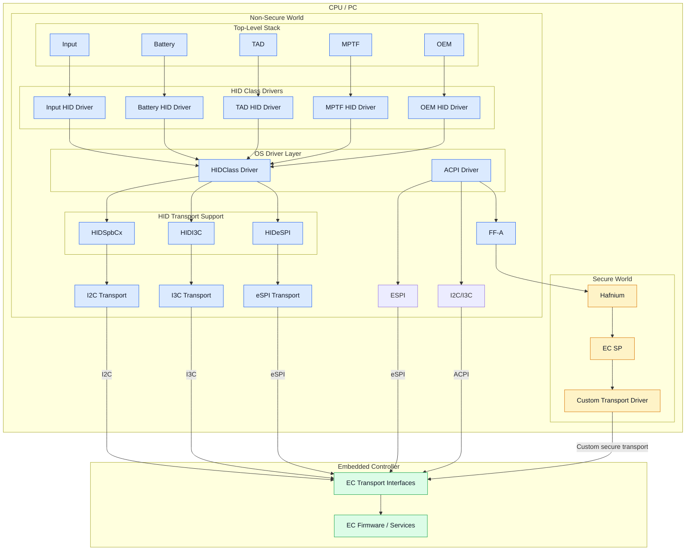

# Embedded Controller Interface Specification

Embedded Controller(EC) Interface Specification describes base set of requirements to interface to core Windows features.

It covers the following areas:
- Firmware Management
- Battery
- Time and Alarm
- UCSI
- Thermal
- Power
- Input Devices
- Customization

## Protocols and Stacks

There are 3 ways to communicate with the EC:

- ACPI specification for Legacy EC controller (eSPI) based interface on x86 devices, directly accessed through OperationRegion in ACPI
- ACPI through FFA driver and in secure world an SV or OEM customer driver to communicate with the EC on ARM devices
- Directly through HID class driver for bus based devices, I2C, I3C and eSPI

This specification is organized accordingly and you can find the details for each protocol in the sub folder.

[Legacy EC Interface](legacy/README.md)

[FFA EC Interface](ffa/README.md)

[HID EC Interface](hid/README.md)

## Transports

While other transports can be wired up to work with OEM or SV drivers we are focused on supporting I2C, I3C and eSPI natively both through direct ACPI access and the HID stacks.

Today there is partial support for I2C and eSPI in ACPI and support for I2C and I3C on HID. To support eSPI natively work is being done to better standardize eSPI based on PCC specification.

The following is a visual of the driver stacks planed to interface with the EC from the OS.

# CPU-to-Embedded-Controller Architecture

