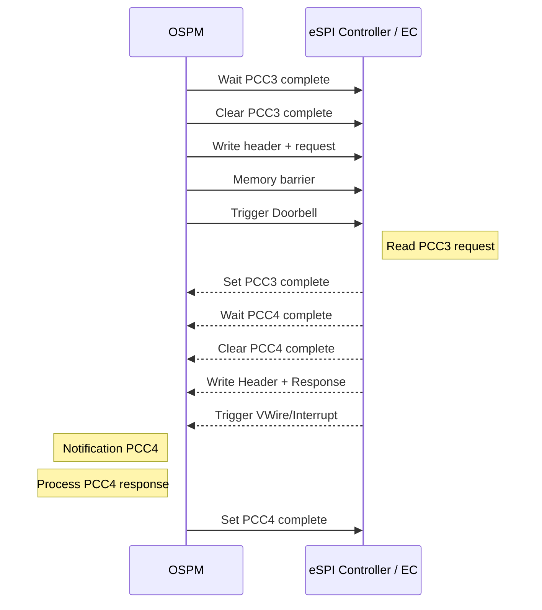

# eSPI ACPI Interface Update

## Purpose

The purpose of this document is to propose an update for the eSPI hardware interface that allows a more efficient and common interface to various eSPI hardware on x86 and ARM designs.

## Current ACPI EC eSPI Interface

The current ACPI design is implemented with 3 I/O ports and two interrupt signals as defined below.

[12. ACPI Embedded Controller Interface Specification — ACPI Specification 6.5 documentation](https://uefi.org/specs/ACPI/6.5/12_Embedded_Controller_Interface_Specification.html)

**I/O Ports**

| **Register** | **Access** | **Purpose**      |
|--------------|------------|------------------|
| EC_SC        | Read       | Status Register  |
| EC_SC        | Write      | Command Register |
| EC_DATA      | Read/Write | Data Register    |

**Status Register**

| **Bit** | **Name** | **Meaning**                    |
|---------|----------|--------------------------------|
| 0       | OBF      | Output Buffer Full             |
| 1       | IBF      | Input Buffer Full              |
| 2       | Reserved |                                |
| 3       | CMD      | Data register contains command |
| 4       | BURST    | EC in burst mode               |
| 5       | SCI_EVT  | SCI query pending              |
| 6       | SMI_EVT  | SMI query pending              |
| 7       | Reserved |                                |

**Command Register**

| **Command** | **Value** |
|-------------|-----------|
| RD_EC       | 0x80      |
| WR_EC       | 0x81      |
| BE_EC       | 0x82      |
| BD_EC       | 0x83      |
| QR_EC       | 0x84      |

## EC Operations

### EC Write Flow

1.  **Wait until ready:** Confirm **EC_SC\[IBF\] = 0**.
2.  **Issue write command:** Write **0x81 (WR_EC)** to **EC_SC**.
3.  **Wait for command acceptance:** Confirm **EC_SC\[IBF\] = 0**.
4.  **Provide address:** Write the EC address to **EC_DATA**.
5.  **Wait for address acceptance:** Confirm **EC_SC\[IBF\] = 0**.
6.  **Provide data:** Write the data byte to **EC_DATA**.
7.  **Complete transaction:** Wait until **EC_SC\[IBF\] = 0**.

### EC Read Flow

1.  **Wait until ready:** Confirm **EC_SC\[IBF\] = 0**.
2.  **Issue read command:** Write **0x80 (RD_EC)** to **EC_SC**.
3.  **Wait for command acceptance:** Confirm **EC_SC\[IBF\] = 0**.
4.  **Provide address:** Write the EC address to **EC_DATA**.
5.  **Wait for response:** Wait until **EC_SC\[OBF\] = 1**.
6.  **Read data:** Read the data byte from **EC_DATA**.

### EC Event Flow

1.  **Receive notification:** OSPM invokes the EC GPE handler.
2.  **Confirm pending SCI:** Verify **EC_SC\[SCI_EVT\] = 1**.
3.  **Wait until ready:** Confirm **EC_SC\[IBF\] = 0**.
4.  **Issue query command:** Write **0x84 (QR_EC)** to **EC_SC**.
5.  **Wait for command acceptance:** Confirm **EC_SC\[IBF\] = 0**.
6.  **Read event code:** Read **EVT = XX** from **EC_DATA**.
7.  **Dispatch handler:** Invoke the corresponding **\_QXX** control method.

> **Note:** The OEM defines the meaning of each event code and its corresponding **\_QXX** method.

## eSPI Features to Address

The following is a list of issues with the current ACPI eSPI EC definition that we are seeking to address:

1.  Current ACPI definition is based on I/O port definition only works on architectures that support I/O ports
2.  Only works for flat memory mapped layout, does not work well with packet-based transactions
3.  Very inefficient throughput for larger transfers of data, it doesn’t take advantage of the actual eSPI protocol ability to send larger packets
4.  Limited VWire support for SMI and SCI, want IRQ and GPIO expansion ability
5.  I/O port model does not allow for easy expansion to multiple channels and protection/securing of channels

## eSPI Proposal over PCC

Existing ACPI specifications are available for defining channel-based communication through PCC.

[14. Platform Communications Channel (PCC) — ACPI Specification 6.5 documentation](https://uefi.org/specs/ACPI/6.5/14_Platform_Communications_Channel.html)

Recommendation is to define a hardware interface that is compatible with PCC Type 3 and 4 that allows us to create inbox ACPI based or driver-based handling of communication with the channel.

Keep PCC Type 0 for a bi-directional flat mapped memory region as existing today and support backward compatible EC’s that are not packet based.

## Hardware Resources

Each eSPI controller consists of channel independent registers, VWire, Peripheral, OOB and Flash Channels. Each of these sections is optional and only present if defined via a resource entry.

### Channel Independent Config

An optional Memory32Fixed region can be defined in the ESPI \_CRS that identifies non-channel independent register configuration as defined in the eSPI specification.

If no resources are defined, then it is presumed that the BIOS or firmware will configure the channels as necessary to operate with the PCC regions defined.

| Start (Hex) | End (Hex) | Register Name                               |
|-------------|-----------|---------------------------------------------|
| 000         | 003       | Reserved                                    |
| 004         | 007       | Device Identification                       |
| 008         | 00B       | General Capabilities and Configurations     |
| 00C         | 00F       | Reserved                                    |
| 010         | 013       | Channel 0 Capabilities and Configurations   |
| 014         | 01F       | Reserved                                    |
| 020         | 023       | Channel 1 Capabilities and Configurations   |
| 024         | 02F       | Reserved                                    |
| 030         | 033       | Channel 2 Capabilities and Configurations   |
| 034         | 03F       | Reserved                                    |
| 040         | 043       | Channel 3 Capabilities and Configurations   |
| 044         | 047       | Channel 3 Capabilities and Configurations 2 |
| 048         | 04B       | Channel 3 Capabilities and Configurations 3 |
| 04C         | 04F       | Channel 3 Capabilities and Configurations 4 |
| 050         | 7FF       | Reserved                                    |
| 800         | FFF       | Platform Specific registers                 |

### Status Registers

The eSPI status register is processed directly by the controller hardware itself and as such isn’t directly exposed. However, the PCC specification requires a doorbell and command complete register for each PCC channel that allows flow control.

**Doorbell** – Requires a single bit in a register or I/O port to indicate when the host has finished writing the data and the device can read the data from the peripheral memory.

**Command Complete** – Requires a single bit in a register or I/O port to indicate that the device has finished processing the data and the host can overwrite it with new data.

**Error Status** – Optional, reports errors to the OS if error recovery isn’t implemented fully in the controller itself.

On existing platforms recommendation is to use an I/O port for each of these. Each bit within the I/O port represents the state for the corresponding channel allowing 8-channels. The mask and values can be programmed via PCC so this isn’t required but a suggested implementation to allow existing hardware to function.

### Global Reset Register

Optional, an MMIO or I/O port register and mask that can be written to that traps into FW to initiate an in-band reset and reconfigures the eSPI config space back to defaults. Any pending transactions are lost, and the controller is in a fresh state.

### VWire Channel

The eSPI controller should decode VWires and allow a configuration that maps at least 16 IRQ’s from index 0 to hard coded SIRQ’s or vectors. These may either be directed to ACPI or the OS may choose to directly register an ISR for these interrupts. The meaning behind these interrupts and what to do in response to them is implementation defined.

How many IRQ’s are supported and their mapping should be defined in the \_CRS of the eSPI device.

System events with indexes 2-7 should be supported via legacy ACPI interface with SCI and SMI support.

Optional support for GPIO expansion via index 128-255 can be defined as well. The details of how those are reported and defining structures need to be decided via MMIO or I/O definitions in future revision.

### Peripheral Channel

There can be multiple sub-channels exposed via a single peripheral channel. Each sub-channel must have a corresponding PCC table defining the channel details and the address of the MMIO region. For packet-based communication there must be two PCC tables defined:

**Type 3** – Initiator table to describe all the communication from the host to the device.

**Type 4** – Responder table to describe all the communication from the device to the host.

For legacy flat mapped memory space which just uses direct memory updates and is not packet based, this region can be directly accessed as MMIO or SystemMemory. Type 0 PCC region may also be used to describe the memory if a doorbell mechanism or more signaling is required.

The doorbell register when written will trigger a peripheral channel transfer of the data length specified by the Length field in the PCC Shared Memory Region.

On systems where MMIO accesses automatically generate peripheral transactions, the doorbell can be set to 0. The command complete register will still need to point to an MMIO or I/O space location to indicate the state of data transfer.

## Sample ACPI Definition for the eSPI PCC Device

The sample separates the namespace device definition from the PCCT subspace records. PCC is exposed as independent subspaces, and the subspace ID is the index of each structure in the PCCT array. The addresses below are illustrative and must be replaced by the platform memory map.

### Illustrative Address Map

| Resource | Base Address | Length | Purpose |
|----|----|----|----|
| Channel-independent configuration | 0xFEDC0000 | 0x1000 | Read-only eSPI identification and channel capability/configuration registers. |
| Global Doorbell Register | 0xFEDC1000 | 0x4 | Doorbell status, allows 32-channels, bit 0-31 represents doorbell status for each channel. |
| Global Command Complete Register | 0xFEDC1004 | 0x4 | Command complete status for 32-channels, one bit per channel. |
| PCC Type 3 shared memory | 0xFEDC2000 | 0x400 | 1024-byte extended master subspace for OS-initiated bidirectional peripheral traffic. |
| PCC Type 4 shared memory | 0xFEDC2400 | 0x400 | 1024-byte extended slave subspace for platform-initiated bidirectional peripheral traffic. |

### Sample SSDT Namespace Definition

DefinitionBlock ("", "SSDT", 2, "OEMID", "ESPIPCC", 0x00000001)  
{  
  Scope (\\SB)  
  {  
    Device (ESPI)  
    {  
      Name (\_HID, "OEM0001")  
      Name (\_UID, Zero)  
      Name (\_DDN, "eSPI PCC Controller")  
      Name (\_STA, 0x0F)  
  
      Name (\_CRS, ResourceTemplate ()  
      {  
        Memory32Fixed (ReadOnly, 0xFEDC0000, 0x00001000, CFG0)  
        Memory32Fixed (ReadWrite, 0xFEDC1000, 0x00000004, STS0)  
        Memory32Fixed (ReadWrite, 0xFEDC1004, 0x00000004, RST0)  
        Memory32Fixed (ReadWrite, 0xFEDC1008, 0x00000008, DBR0)  
        Memory32Fixed (ReadWrite, 0xFEDC1010, 0x00000004, VWF0)  
      })  
  
      OperationRegion (ECFG, SystemMemory, 0xFEDC0000, 0x1000)  
      OperationRegion (GCSR, SystemMemory, 0xFEDC1000, 0x0014)  
      Field (GCSR, DWordAcc, NoLock, Preserve)  
      {  
        GSTA, 32,  
        GRST, 1, Reserved, 31,  
        DB00, 1, Reserved, 31,  
        AK00, 1, Reserved, 31,  
        VWFR, 32  // VWire FIFO, offset 0x10  
      }  
  
      // Extended PCC shared-memory header: 16 bytes, followed by 1008-byte payload.  
      OperationRegion (PCC3, PCC, 0, 0x400)  // Host -\> EC, Type 3  
      Field (PCC3, DWordAcc, NoLock, Preserve)  
      {  
        C3SG, 32,  // Signature, offset 0x00  
        C3FL, 32,  // Flags, offset 0x04  
        C3LN, 32,  // Length, offset 0x08  
        C3CM, 32,  // Command, offset 0x0C  
        C3DT, 8064  // Payload, offset 0x10, 1008 bytes  
      }  
  
      OperationRegion (PCC4, PCC, 1, 0x400)  // EC -\> Host, Type 4  
      Field (PCC4, DWordAcc, NoLock, Preserve)  
      {  
        C4SG, 32,  // Signature, offset 0x00  
        C4FL, 32,  // Flags, offset 0x04  
        C4LN, 32,  // Length, offset 0x08  
        C4CM, 32,  // Command, offset 0x0C  
        C4DT, 8064  // Payload, offset 0x10, 1008 bytes  
      }  
  
      Method (ERST, 0, Serialized)  
      {  
        Store (One, GRST)  
      }  
    }  
  }  
}

**Namespace notes:** **PCC3** references PCCT subspace ID 0 and **PCC4** references subspace ID 1. Each OperationRegion remains exactly **0x400 bytes**. The first **16 bytes** follow the Extended PCC shared-memory header layout: a 32-bit **Signature** at offset 0x00, 32-bit **Flags** at offset 0x04, 32-bit **Length** at offset 0x08, and 32-bit **Command** at offset 0x0C. The remaining **1008 bytes**, starting at offset 0x10, are available for the eSPI packet payload.

### Sample PCCT Subspace Definitions

The PCCT contains an ordered array of PCC subspace structures, with the array index becoming the PCC subspace ID. The following pseudo-definition shows the fields that platform firmware would emit for the two channels; exact C structure names depend on the firmware ACPI table library.

PCCT.Header.Signature = 'PCCT'  
PCCT.Header.Revision = 2  
PCCT.Flags = 1  // Platform interrupt supported  
  
// Subspace ID 0: Extended PCC Master (Type 3)  
Type = 3  
Length = sizeof (TYPE3_SUBSPACE)  
PlatformInterrupt = \<GSI used by the eSPI controller\>  
InterruptFlags = \<edge/level and polarity for that GSI\>  
BaseAddress = 0x00000000FEDC2000  
AddressLength = 0x0000000000000400  // 1024 bytes  
DoorbellRegister = GAS(SystemMemory, 32, 0, DWord, 0xFEDC1008)  
DoorbellPreserve = 0xFFFFFFFE  
DoorbellWrite = 0x00000001  
CommandCompleteCheck = GAS(SystemMemory, 32, 0, DWord, 0xFEDC1000)  
CommandCompleteMask = 0x00000001  
CommandCompleteValue = 0x00000001  
ErrorStatusRegister = GAS(SystemMemory, 32, 0, DWord, 0xFEDC1000)  
ErrorStatusMask = 0x00000002  
  
// Subspace ID 1: Extended PCC Slave (Type 4)  
Type = 4  
Length = sizeof (TYPE4_SUBSPACE)  
PlatformInterrupt = \<GSI used by the eSPI controller\>  
InterruptFlags = \<edge/level and polarity for that GSI\>  
BaseAddress = 0x00000000FEDC2400  
AddressLength = 0x0000000000000400  // 1024 bytes  
DoorbellRegister = GAS(SystemMemory, 32, 0, DWord, 0xFEDC1008)  
DoorbellPreserve = 0xFFFFFFFE  
DoorbellWrite = 0x00000001  
CommandCompleteCheck = GAS(SystemMemory, 32, 0, DWord, 0xFEDC1000)  
CommandCompleteMask = 0x00000004  
CommandCompleteValue = 0x00000004  
PlatformAckRegister = GAS(SystemMemory, 32, 0, DWord, 0xFEDC100C)  
PlatformAckPreserve = 0xFFFFFFFE  
PlatformAckWrite = 0x00000001

## Sample PCC Type 3 and Type 4 Call Flows

PCC communication uses independent subspaces, shared memory, a doorbell protocol, platform notification, and completion/status registers. The following sample maps those mechanisms to the document’s Type 3 **PCC3** initiator channel and Type 4 **PCC4** platform-notification channel.

CCC = Command Complete Check register

### Initiator/Responder Call Flow: Host 🡪 eSPI Device

